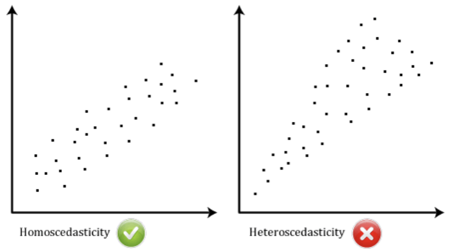
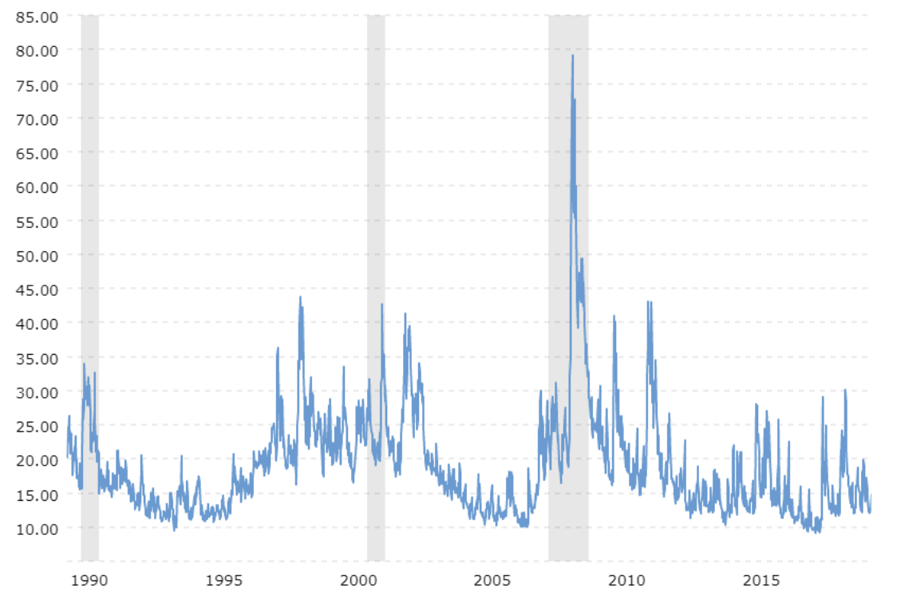

# Fundamentos del Modelo GARCH

¿Qué son los modelos GARCH, para qué se utilizan y cómo implementarlos en Python? Tras completar este capítulo, podrá responder con seguridad a todas estas preguntas.

**GARCH:** significa *"Heterocedasticidad Condicional Autorregresiva Generalizada"* .

La **heterocedasticidad** es un enfoque popular para modelar volatilidad.

## ¿ Qué es volatilidad?

-   En finanzas, la volatilidad es una medida estadística de la dispersión de los rendimientos de los activos a lo largo del tiempo.

-   A menudo se calcula como la desviación estándar o varianza de los rendimientos (o retornos) de precios.

-   En este documento utilizaremos el término ***"volatilidad"*** para describir la desviación estándar o la varianza indistintamente.

Este es un concepto esencial ampliamente utilizado en la gestión de riesgos, la optimización de carteras y más. Y ha sido una de las áreas de investigación más activas en finanzas empíricas y análisis de series de tiempo.

En general, cuanto mayor sea la volatilidad, más riesgoso será un activo financiero.

## Calculo de la Volatilidad

Podemos calcular la volatilidad como la desviación estándar de los rendimientos de precios siguiendo tres sencillos pasos:

1.  **Paso 1:** calcular los rendimientos como cambios porcentuales de precios. $$return = \frac{P_1 - P_0}{P_0}$$

2.  **Paso 2:** calcular el rendimiento medio de la muestra de un período $n$ elegido. $$mean = \frac{\sum_{i=1}^n return_i}{n}$$

3.  **Paso 3:** derivar la desviación estándar de la muestra $$volatilidad (\sigma) = \sqrt{\frac{\sum_{i=1}^n (return_i - mean)^2}{n-1}} = \sqrt{varianza}$$

Recuerde que la desviación estándar es la raíz cuadrada de la varianza.

## Calculo de Volatilidad en `Python`

Antes de que te de dolor de cabeza mirar las fórmulas matemáticas, la buena noticia es que puedes implementarlas en Python fácilmente.

Para calcular los cambios porcentuales como rendimientos, aplicamos el método `"pct_change()"` del paquete `"pandas"` a los datos de precios, por ejemplo:

```{Bash}
return_data = price_data.pct_change()
```

Luego aplicamos el método `"std()"` a los datos devueltos para calcular la desviación estándar.

```{Bash}
Volatilidad = return_data.std()
```

## Conversión de Volatilidad

Supongamos que medimos la volatilidad como la desviación estándar de los rendimientos, entonces se puede obtener la volatilidad mensual multiplicando la volatilidad diaria por la raíz cuadrada de 21, que es el número promedio de días de negociación en un mes.

$$
\sigma_{mensual} = \sqrt{21}\times \sigma_{d} 
$$

De manera similar, la volatilidad anual se puede obtener multiplicando la volatilidad diaria por la raíz de 252, que es el número promedio de días de negociación en un año.

$$
\sigma_{anual} = \sqrt{252}\times \sigma_{d}
$$

## Desafío del modelado de la volatilidad

Un supuesto común en el modelado de series temporales es que la volatilidad permanece constante a lo largo del tiempo. Sin embargo, **heterocedasticidad**, literalmente significa ***"diferente".***

El termino "dispersión" en griego antiguo se observa con frecuencia en los datos de rendimiento financiero.

La volatilidad tiende a aumentar o disminuir sistemáticamente con el tiempo.

## Detectando Heterocedasticidad

Una forma sencilla de detectar la heterocedasticidad en una serie temporal consiste en gráficar los datos y observar su comportamiento a lo largo del tiempo.

### Homocedasticidad vs Heterocedasticidad

En comparación con los datos homocedásticos, la volatilidad de los heterocedásticos los datos no parecen estables, sino que presentan fluctuaciones dependientes del tiempo.

{width="500"}

El índice VIX derivado de los precios de las acciones del S&P500, es un barómetro de la volatilidad esperada del mercado de valores de EE.UU. y del sentimiento de riesgo.

{width="700"}

Como se muestra en el gráfico de precios históricos, el VIX demuestra "volatilidad". Es muy probable que los grandes de precios sean seguidos por cambios más grandes, y viceversa. La agrupación de la volatilidad ocurre porque los mercados tienden a responder a nuevos shocks de información, con un movimiento dramático de precios, y toma tiempo para que el efecto impactante se resuelva y se disipe.

## Observando la agrupación de la volatilidad

La agrupación de la volatilidad se observa con frecuencia en los datos del mercado financiero y plantea un desafío para el modelado de series de tiempo.

En este ejercicio, nos familiarizaremos con el conjunto de datos de precios diarios del S&P500. Calcularemos las rentabilidades diarias a medida que cambia el precio porcentual, graficaremos los resultados y observaremos su comportamiento a lo largo del tiempo

```{python}
import pandas as pd

sp_price = pd.read_csv('/Users/juanisaulamejia/Documents/2025/GARCH Model/Data/SP500.csv')
```

-   Comencemos calculando los rendimientos diarios como cambios porcentuales y guardamos en el dataframe `sp_price` en una nueva columna llamada `Return`.

    ```{python, grafico_return, include = TRUE}
    import matplotlib
    matplotlib.use("Agg")
    import matplotlib.pyplot as plt
    plt.rcParams["figure.dpi"] = 150
    # Cambios porcentuales 
    sp_price['Return'] = 100 * (sp_price['Close'].pct_change())

    # Ultimos 10 datos del sp_price
    print(sp_price.tail(10))

    # Plot de Return
    plt.plot(sp_price['Return'], color = 'tomato', label = 'Daily Returns')
    plt.legend(loc='upper right')
    plt.grid(True)
    plt.tight_layout()
    plt.show()
    ```

    \
    Como se muestra en el gráfico, el mercado presentó periodos de alta volatilidad seguidos de periodos de baja volatilidad.\

Ahora calculemos la volatilidad diaria como la desviación estándar de la rentabilidad de los precios. Luego, convertirá la volatilidad diaria en la volatilidad mensual y anual.

```{python}
std_daily = sp_price['Return'].std()
print('volatilidad Diaria: ', '{:.2f}%'.format(std_daily))
```

Ahora calculemos la volatilidad mensual a partir de la volatilidad diaria:

```{python}
import math
std_monthly = math.sqrt(21) * std_daily
print ('volatilidad Mensual: ', '{:.2f}%'.format(std_monthly))
```

Y Luego la volatilidad anual a partir de la volatilidad diaria:

```{python}
std_annual = math.sqrt(252) * std_daily
print ('Volatilidad Anual: ', '{:.2f}%'.format(std_annual))
```

Observe que el mercado es realmente arriesgado. La volatilidad anualizada del S&P500 indica que sus rendimientos reales pueden fluctuar más del 10% en torno a la rentabilidad media.
