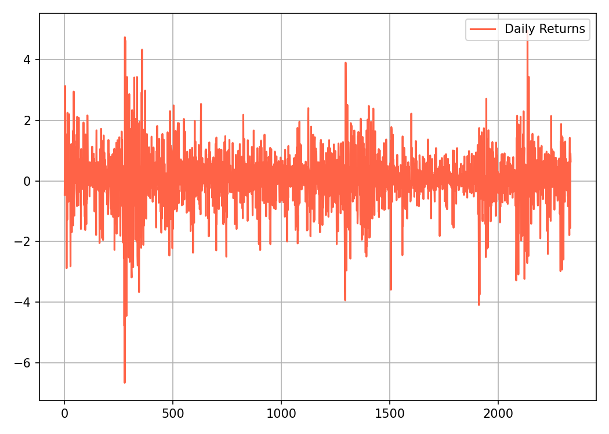
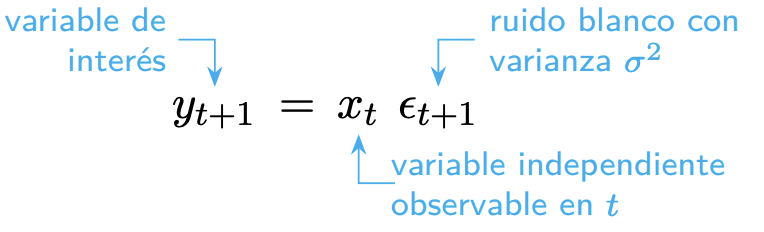

# Fundamentos del Modelo GARCH

¿Qué son los modelos GARCH, para qué se utilizan y cómo implementarlos en Python? Tras completar este capítulo, podrá responder con seguridad a todas estas preguntas.

**GARCH:** significa *"Heterocedasticidad Condicional Autorregresiva Generalizada"* .

La **heterocedasticidad** es un enfoque popular para modelar volatilidad.

## Volatilidad

-   En finanzas, la volatilidad es una medida estadística de la dispersión de los rendimientos de los activos a lo largo del tiempo.

-   A menudo se calcula como la desviación estándar o varianza de los rendimientos (o retornos) de precios.

La volatilidad es una característica inherente a las series de tiempo financieras. En general, no es constante y en consecuencia los modelos de series de tiempo tradicionales que suponen varianza homocedástica, no son adecuados para modelar series de tiempo Financieras.

En general, cuanto mayor sea la volatilidad, más riesgoso será un activo financiero.

## Calculo de la Volatilidad

Podemos calcular la volatilidad como la desviación estándar de los rendimientos de precios siguiendo tres sencillos pasos:

1.  **Paso 1:** calcular los rendimientos como cambios porcentuales de precios. Sea $P_t, t = 1, 2, . . . ,$ el precio de un activo en el tiempo $t$. Asumiendo que el activo no paga dividendos, su tenencia por un período de tiempo, desde $t-1$ hasta $t$, producirá un retorno simple definido como $$R_t = \frac{P_t}{P_{t-1}} - 1 = \frac{P_t - P_{t-1}}{P_{t-1}}$$ Sobre este período de tiempo se define el *log-retorno* $(r_t)$, mediante la expresión: $$r_t = \ln(R_t + 1) = \ln(P_t) - \ln(P_{t-1})$$ Obsérvese que la serie de los log-retornos, que llamaremos la serie de los retornos, no tiene unidades, es estable en la medida y facilita el cálculo de un retorno compuesto $k$ períodos desde el tiempo $t-1$ hasta el periodo $t$ (Tsay 2002). Así: $$r_t[k] = \ln(1 + R_t[k]) = \ln\left(\begin{array}{c}\prod_{i=1}^k \ln(1 + R_i)\end{array}\right) = r_t + r_{t-1} + . . . + r_{t-k}$$

2.  **Paso 2:** calcular el rendimiento medio de la muestra de un período $n$ elegido. $$mean = \frac{\sum_{i=1}^n R_i}{n}$$

3.  **Paso 3:** derivar la desviación estándar de la muestra $$volatilidad (\sigma) = \sqrt{\frac{\sum_{i=1}^n (R_i - mean)^2}{n-1}} = \sqrt{varianza}$$

Recuerde que la desviación estándar es la raíz cuadrada de la varianza.

## Características de la Volatilidad

En el caso de las series de tiempo financieras, se modela la volatilidad de los rendimientos. Es de anotar que, aunque la serie sea estacionaria y tenga, por tanto, varianza constante, puede presentar oscilaciones a corto plazo que es lo que recoge la varianza condicional para el estudio de la volatilidad cuyo conocimiento es de interés, en particular, para hacer predicciones a corto plazo. ***Debido a que la volatilidad varía en el tiempo, los modelos clásicos de series de tiempo no son adecuados para modelarlas, puesto que uno de sus supuestos es que la varianza es constante.***

La volatilidad no es observable directamente, para un día por ejemplo, se tiene una única observación. En las series financieras se presenta períodos largos de alta volatilidad seguidos por períodos de baja volatilidad, lo que indica la presencia de heterocedasticidad. Son más interesantes las medias y las varianzas condicionadas a la información pasada (pronósticos a corto plazo) que las medias y varianzas no condicionadas (pronósticos a largo plazo).

Un buen modelo para volatilidad debe tener la capacidad de pronósticarla; por tanto, debe modelar sus características. En general, esta clase de modelos es utilizada para hacer proyecciones y estimaciones, por ejemplo, pronosticar el valor absoluto de la magnitud de los retornos de los precios de un activo, estimar cuantiles o incluso toda la función de densidad de probabilidad de los retornos.

Un buen modelo para la volatilidad de los rendimientos o retornos debe reflejar las siguientes características (Engle y Patton 2001):

-   **Aglomeración de la volatilidad:** La volatilidad tiene tendencia a aparecer agrupada por períodos, es decir, que la volatilidad puede ser alta durante un período y baja durante otro. A grandes cambios en la volatilidad siguen cambios grandes; a pequeños cambios, siguen pequeños cambios de volatilidad. Este comportamiento ha sido reportado en numerosos estudios, como @Baillie1996 , @Chou1988 y @Schwert1989 . A la aglomeración de la volatilidad se debe el hecho de que los choques de hoy influyan en el valor esperado de la volatilidad varios períodos en el futuro.

-   **Reversión a la media:** La volatilidad tiende a revertirse a la media, en otros términos, existe un nivel normal de volatilidad al cual ésta retorna eventualmente. Los pronósticos a largo plazo convergerán todos al nivel normal de la volatilidad, sin importar cuando fueron hechos.

-   **La volatilidad es asimétrica:** La volatilidad se comporta diferente frente a innovaciones positivas o negativas. No reacciona de la misma manera frente a una gran alza en el precio de un activo que frente a una caída en su precio. Varios de los modelos imponen el supuesto de que la varianza condicional es afectada simétricamente por las innovaciones positivas y negativas, por ejempl, en un modelo ARCH(p), la varianza depende del cuadrado de las innovaciones retardadas, ignorando este efecto de asimetría. Esta asimetría recibe el nombre de *efecto de apalancamiento* y ha sido modelada entre otros, por los EGARCH. Evidencia de este efecto ha sido encontrada por @Nelson1991, @Glosten1993, @Engle1993, entre otros.

-   **Influencia de variables exógenas:** Evidentemente, nadie considera que los precios de los activos financieros evolucionan independientemente los mercados alrededor de éstos y, por ello, cabría esperar que existan variables que contengan información relevante para la volatilidad de la serie. \
    - Es posible que eventos determinísticos repercutan, también en la volatilidad de la serie. Ejemplos de tales eventos pueden ser los informes periódicos de una compañia, las nuevas políticas macroeconómicas. Por ejemplo, @Andersen1998 hallaron que la volatilidad de la tasa de cambios del dólar, frente al marco alemán, aumentaba, notablemente, en la época en la que se publicaba la nueva información macroeconómica de Estados Unidos, como el Reporte de Empleo o el Indice del Precio de Producción.

-   **Distribución de Probabilidad:** La distribución de probabilidad de los retornos tiene colas pesadas y, en general, exceso de curtosis.

## Calculo de Volatilidad en `Python`

Antes de que te de dolor de cabeza mirar las fórmulas matemáticas, la buena noticia es que puedes implementarlas en Python fácilmente.

Para calcular los cambios porcentuales como rendimientos, aplicamos el método `"pct_change()"` del paquete `"pandas"` a los datos de precios, por ejemplo:

```{Bash}
return_data = price_data.pct_change()
```

Luego aplicamos el método `"std()"` a los datos devueltos para calcular la desviación estándar.

```{Bash}
Volatilidad = return_data.std()
```

## Conversión de Volatilidad

Supongamos que medimos la volatilidad como la desviación estándar de los rendimientos, entonces se puede obtener la volatilidad mensual multiplicando la volatilidad diaria por la raíz cuadrada de 21, que es el número promedio de días de negociación en un mes.

$$
\sigma_{mensual} = \sqrt{21}\times \sigma_{d} 
$$

De manera similar, la volatilidad anual se puede obtener multiplicando la volatilidad diaria por la raíz de 252, que es el número promedio de días de negociación en un año.

$$
\sigma_{anual} = \sqrt{252}\times \sigma_{d}
$$

## Desafío del modelado de la volatilidad

Un supuesto común en el modelado de series temporales es que la volatilidad permanece constante a lo largo del tiempo. Sin embargo, **heterocedasticidad**, literalmente significa ***"diferente".***

El termino "dispersión" en griego antiguo se observa con frecuencia en los datos de rendimiento financiero.

La volatilidad tiende a aumentar o disminuir sistemáticamente con el tiempo.

## Detectando Heterocedasticidad

Una forma sencilla de detectar la heterocedasticidad en una serie temporal consiste en gráficar los datos y observar su comportamiento a lo largo del tiempo.

### Homocedasticidad vs Heterocedasticidad

En comparación con los datos homocedásticos, la volatilidad de los heterocedásticos los datos no parecen estables, sino que presentan fluctuaciones dependientes del tiempo.

{width="500"}

El índice VIX derivado de los precios de las acciones del S&P500, es un barómetro de la volatilidad esperada del mercado de valores de EE.UU. y del sentimiento de riesgo.

{width="700"}

Como se muestra en el gráfico de precios históricos, el VIX demuestra "volatilidad". Es muy probable que los grandes de precios sean seguidos por cambios más grandes, y viceversa. La agrupación de la volatilidad ocurre porque los mercados tienden a responder a nuevos shocks de información, con un movimiento dramático de precios, y toma tiempo para que el efecto impactante se resuelva y se disipe.

## Observando la agrupación de la volatilidad

La agrupación de la volatilidad se observa con frecuencia en los datos del mercado financiero y plantea un desafío para el modelado de series de tiempo.

En este ejercicio, nos familiarizaremos con el conjunto de datos de precios diarios del S&P500. Calcularemos las rentabilidades diarias a medida que cambia el precio porcentual, graficaremos los resultados y observaremos su comportamiento a lo largo del tiempo

```{python}
import pandas as pd

sp_price = pd.read_csv('/Users/juanisaulamejia/Documents/2025/GARCH Model/Data/SP500.csv')
```

-   Comencemos calculando los rendimientos diarios como cambios porcentuales y guardamos en el dataframe `sp_price` en una nueva columna llamada `Return`.

    ```{python}
    import matplotlib
    matplotlib.use("Agg")
    import matplotlib.pyplot as plt

    # Cambios porcentuales 
    sp_price['Return'] = 100 * (sp_price['Close'].pct_change())

    # Ultimos 10 datos del sp_price
    print(sp_price.tail(10))

    ```

    ```{python grafico_return, eval = FALSE}
    # Plot de Return
    plt.plot(sp_price['Return'], color = 'tomato', label = 'Daily Returns')
    plt.legend(loc='upper right')
    plt.grid(True)
    plt.tight_layout()

    # ¡Guardar en archivo y NO usar plt.show()!
    plt.savefig("grafico_return.png", dpi=150)
    ```

    ```{r fig-grafico-return, echo=FALSE}
    
    ```

Como se muestra en el gráfico, el mercado presentó periodos de alta volatilidad seguidos de periodos de baja volatilidad.

Ahora calculemos la volatilidad diaria como la desviación estándar de la rentabilidad de los precios. Luego, convertirá la volatilidad diaria en la volatilidad mensual y anual.

```{python}
std_daily = sp_price['Return'].std()
print('volatilidad Diaria: ', '{:.2f}%'.format(std_daily))
```

Ahora calculemos la volatilidad mensual a partir de la volatilidad diaria:

```{python}
import math
std_monthly = math.sqrt(21) * std_daily
print ('volatilidad Mensual: ', '{:.2f}%'.format(std_monthly))
```

Y Luego la volatilidad anual a partir de la volatilidad diaria:

```{python}
std_annual = math.sqrt(252) * std_daily
print ('Volatilidad Anual: ', '{:.2f}%'.format(std_annual))
```

Observe que el mercado es realmente arriesgado. La volatilidad anualizada del S&P500 indica que sus rendimientos reales pueden fluctuar más del 10% en torno a la rentabilidad media.

## Origenes del ARCH y GARCH

Profundicemos un poco más en los modelos GARCH. Antes de GARCH, vinieron los modelos ARCH.

ARCH: significa *"Heteroscedasticidad condicional autorregresiva"* y fue desarrollada por el economista estadounidense Robert F. Engle en 1982.

Aquí, *"heterocedasticidad condicional"* significa que los datos tienen características variables que dependen del tiempo y son impredecibles.

Por su contribución, Engle ganó el Premio Nobel de Economía en 2003.

{width="200"}

## Luego vino el GARCH

Basados en ARCH, los modelos GARCH fueron desarrollados por el economista danés Tim Bollerslev en 1986.

-   La **"G"** en GARCH significa *"Generalizado"* . Dato curioso: Bollerslev escribió sobre los modelos GARCH en su doctorado como trabajo de tesis, bajo la dirección de Engle, quien fue el inventor de los modelos ARCH.

    {width="200"}

Antes de sumergirnos en las ecuaciones del modelo GARCH, aclaremos algunos términos básicos.

**Ruido Blanco** $(z)$**:** Variables aleatorias no correlacionadas con media cero y varianza finita.

{width="400"}

**Una serie temporal** es ruido blanco si las variables son independientes y se distribuyen idénticamente con una media de cero.

**Residuo:** un residuo es la diferencia entre el valor observado de una variable en una serie de tiempo $t$ y su valor predicho basado en información disponible antes del tiempo $t$. $$Residuo = Value_{predicho} - Value_{observado}$$

Si el modelo de predicción funciona correctamente, los residuos sucesivos no están correlacionados entre si, es decir, constituyen una serie temporal de ruido blanco. En otras palabras, el modelo se ha encargado de todos los aspectos predecibles, estos aspectos son componentes de una serie temporal, dejando sólo la parte impredecible de ruido blanco.

## La volatilidad de muchas series no es constante

-   En modelos econométricos convencionales, se asume que la varianza del término de error es constante.

-   Muchas series de tiempo económicas exhiben períodos de volatilidad inusualmente alta, seguidos por períodos de relativa tranquilidad.

-   En tales circunstancias, el supuesto de **homoscedasticidad** es inapropiado.

-   En ocasiones, uno puede estar interesado en pronosticar la **varianza condicional** de una serie.

-   Consideremos el mercado accionario. Algunas veces el mercado es muy volatil, otras veces no.

-   La volatilidad del retorno de las acciones determina el riesgo de las inversiones.

-   En finanzas se tiene por cierto que el riesgo y el retorno están correlacionados positivamente.

-   Para hacer buenas inversiones, es crucial entender el riesgo apropiadamente.

{width="800"}

{width="800"}

{width="800"}

### Pronosticando la Varianza 

-   Un enfoque para pronosticar la varianza es introducir explícitamente una variable independiente que ayude a predecir la volatilidad.

-   Por ejemplo \
    \
    {width="300"}

-   Si $x_t = x_{t-1} = . . .$ una constante, entonces $\{y_t\}$ es ruido blanco.

-   De lo contrario, la varianza de $y_{t+1}$ condicional en el valor observado $x_t$ es $$Var\left(\begin{array}{c}y_{t+1} | x_t\end{array}\right) = x_t^2\sigma^2$$

-   Si $x_t$ tiene correlación serial positiva, entonces la varianza condicional $y_{t+1}$ también la tendrá.

## El modelo ARCH

En terminos generales, todos los modelos ARCH (y GARCH, que estudiaremos) consisten en dos ecuaciones:

1.  **Una ecuación de la media**, que describe la evolución de la variable de interés $y_t$.

2.  **Una ecuación de la varianza**, que describe la evolución de la varianza de $y_t$.

3.  En adelante, vamos a denotar por $\Omega_t$ todos los datos realizados hasta la fecha $t$.

El modelo ARCH(1) está definido por estas dos ecuaciones:

$$
y_t = c + \epsilon_t \longrightarrow (media)
$$

$$
\epsilon_t = u_t\sqrt{\alpha_0 + \alpha_1\epsilon_{t-1}^2} \longrightarrow (varianza)
$$

donde $u_t\sim N(0, 1)$, $\alpha_0 > 0$, y $\alpha_1 > 0$.

La idea básica de los modelos ARCH es que:

-   El impacto de un rendimiento de activos no está correlaciondo en serie, pero si depende.

-   La dependencia de $\epsilon_t$ se puede describir mediante una función cuadrática simple de sus valores retrasados. Específicamente, un modelo `ARCH(q)` asume que $$\alpha_t = \sigma_t\epsilon_t, \hspace{1cm} \sigma_t^2 = \alpha_0 + \alpha_1\epsilon_{t-1}^2 + . . . + \alpha_q\epsilon_{t-q}^2$$

-   
