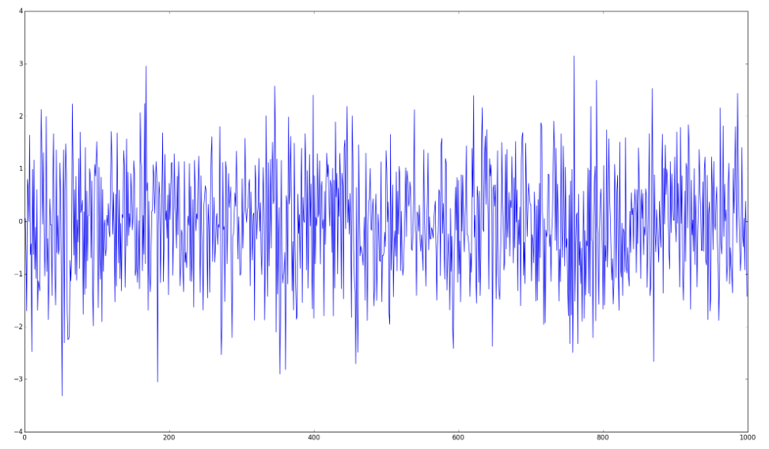
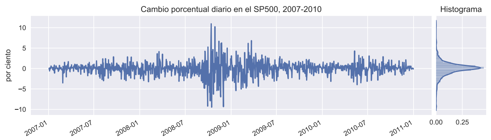
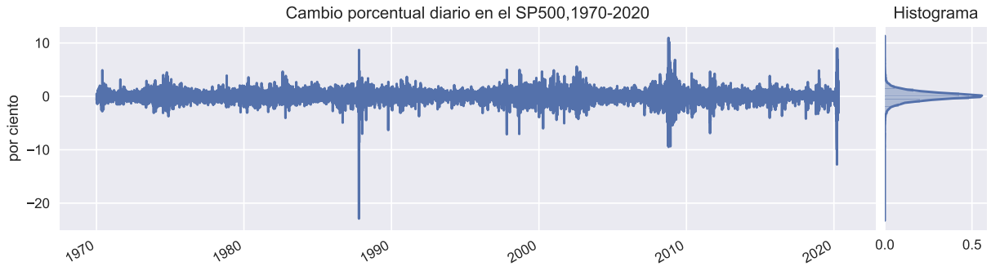
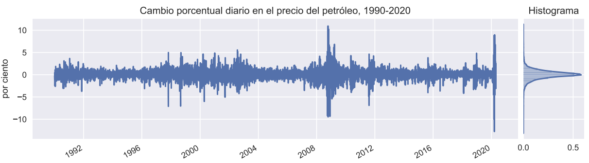

# ¿Qué son ARCH y GARCH?

Profundicemos un poco más en los modelos GARCH. Antes de GARCH, vinieron los modelos ARCH.

ARCH: significa *"Heteroscedasticidad condicional autorregresiva"* y fue desarrollada por el economista estadounidense Robert F. Engle en 1982.

Aquí, *"heterocedasticidad condicional"* significa que los datos tienen características variables que dependen del tiempo y son impredecibles.

Por su contribución, Engle ganó el Premio Nobel de Economía en 2003.

{width="200"}

## Luego vino el GARCH

Basados en ARCH, los modelos GARCH fueron desarrollados por el economista danés Tim Bollerslev en 1986.

-   La **"G"** en GARCH significa *"Generalizado"* . Dato curioso: Bollerslev escribió sobre los modelos GARCH en su doctorado como trabajo de tesis, bajo la dirección de Engle, quien fue el inventor de los modelos ARCH.

    {width="200"}

Antes de sumergirnos en las ecuaciones del modelo GARCH, aclaremos algunos términos básicos.

**Ruido Blanco** $(z)$**:** Variables aleatorias no correlacionadas con media cero y varianza finita.

{width="400"}

**Una serie temporal** es ruido blanco si las variables son independientes y se distribuyen idénticamente con una media de cero.

**Residuo:** un residuo es la diferencia entre el valor observado de una variable en una serie de tiempo $t$ y su valor predicho basado en información disponible antes del tiempo $t$. $$Residuo = Value_{predicho} - Value_{observado}$$

Si el modelo de predicción funciona correctamente, los residuos sucesivos no están correlacionados entre si, es decir, constituyen una serie temporal de ruido blanco. En otras palabras, el modelo se ha encargado de todos los aspectos predecibles, estos aspectos son componentes de una serie temporal, dejando sólo la parte impredecible de ruido blanco.

## La volatilidad de muchas series no es constante 

-   En modelos econométricos convencionales, se asume que la varianza del término de error es constante.

-   Muchas series de tiempo económicas exhiben períodos de volatilidad inusualmente alta, seguidos por períodos de relativa tranquilidad.

-   En tales circunstancias, el supuesto de **homoscedasticidad** es inapropiado.

-   En ocasiones, uno puede estar interesado en pronosticar la **varianza condicional** de una serie.

-   Consideremos el mercado accionario. Algunas veces el mercado es muy volatil, otras veces no.

-   La volatilidad del retorno de las acciones determina el riesgo de las inversiones.

-   En finanzas se tiene por cierto que el riesgo y el retorno están correlacionados positivamente.

-   Para hacer buenas inversiones, es crucial entender el riesgo apropiadamente.

{width="800"}

{width="800"}

{width="800"}

